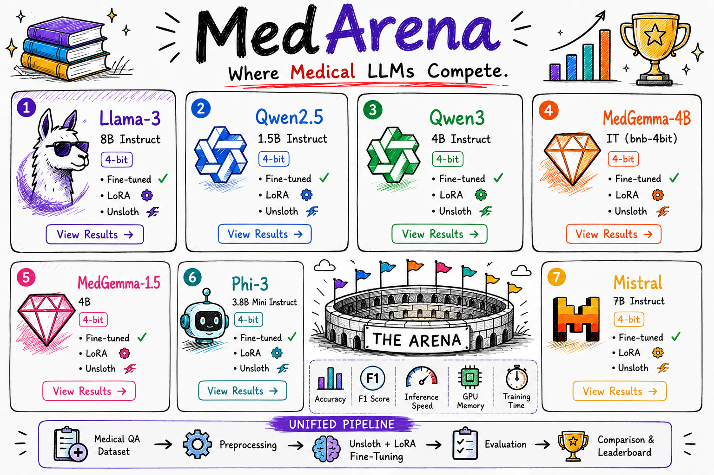

# MedArena

### **Where Medical LLMs Compete**

  

**Benchmarking Multiple Unsloth-Supported Large Language Models for Medical Question Answering**

**One Dataset • Multiple Models • One Arena**

---

## Overview

**MedArena** is a comprehensive benchmarking project designed to evaluate multiple lightweight open-source Large Language Models for **Medical Question Answering (Medical QA)**.

Instead of focusing on a single model, this repository benchmarks several **Unsloth-supported LLMs** under the **same preprocessing pipeline, training configuration, and evaluation protocol**, enabling fair and reproducible comparisons.

The project investigates how different models balance:

* Medical reasoning capability
* Fine-tuning efficiency
* GPU memory consumption
* Inference speed
* Overall predictive performance

---

# The Arena

Every model enters the arena under identical conditions.

* Same Medical QA Dataset
* Same Prompt Template
* Same LoRA Configuration
* Same Hyperparameters
* Same Evaluation Metrics

Only performance determines the winner.

---

## Models

| Model | Parameters | Quantization |
|:-------------------------|:----------:|:------------:|
| Llama-3-8B-Instruct | 8B | 4-bit |
| Qwen2.5-1.5B-Instruct | 1.5B | 4-bit |
| Qwen3-4B | 4B | 4-bit |
| MedGemma-1.5 | 4B | 4-bit |
| MedGemma-4B-IT | 4B | 4-bit |
| Phi-3 Mini | 3.8B | 4-bit |
| Mistral-7B-Instruct | 7B | 4-bit |

---

# Evaluation Metrics

Each model is evaluated using:

* Accuracy
* Precision
* Recall
* F1 Score
* GPU Memory Usage
* Training Time
* Inference Speed

---

# Features

* Multi-Model Medical LLM Benchmark
* Powered by Unsloth
* LoRA Fine-Tuning
* 4-bit Quantization
* Hugging Face Transformers
* Fair Performance Comparison
* Memory-Efficient Training
* Medical Question Answering
* Unified Evaluation Pipeline

---

# keep Aspects

The objective of MedArena is to identify the most effective and resource-efficient open-source medical language model by comparing:

* Medical reasoning quality
* Fine-tuning efficiency
* Hardware requirements
* Inference latency
* Overall predictive performance

---

# Future Work

* Benchmark additional open-source medical LLMs
* Evaluate larger Medical QA datasets
* Compare LoRA vs QLoRA
* Multi-GPU training
* RAG integration
* Clinical instruction tuning
* Medical reasoning evaluation

---

# Observed

> **Less Memory. More Intelligence.**
